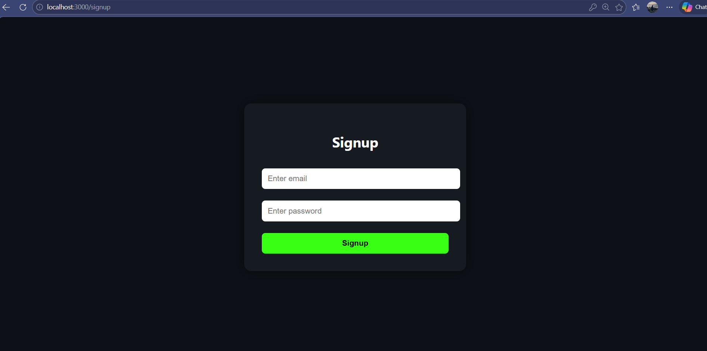
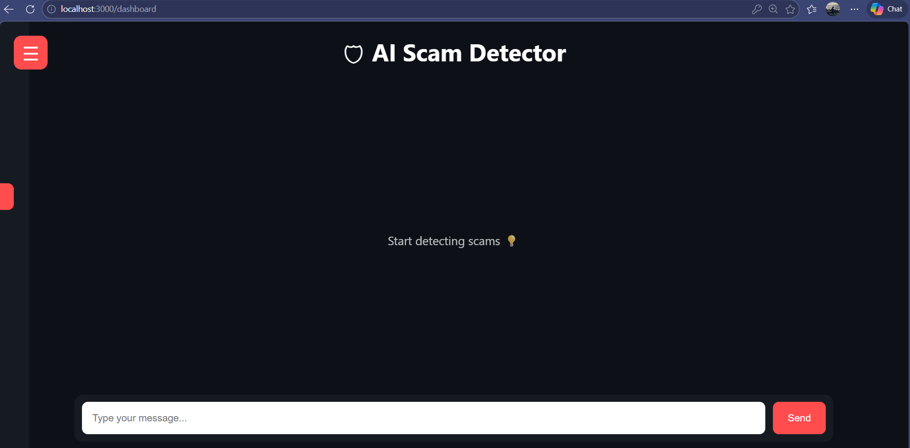
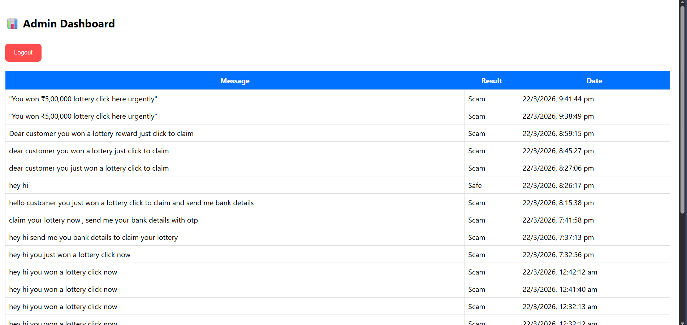

# 🛡 AI Scam Detector

A full-stack MERN + Machine Learning project that detects scam messages using an ML model and provides explanations.

---

## 🚀 Features

- 🔐 User Authentication (Login / Signup)
- 🧠 AI + ML Scam Detection
- 📊 Scam Probability Prediction
- 🚨 Suspicious Keyword Detection
- 💡 Explanation of Results
- 📂 Admin Panel (View all checks)
- ☰ Sidebar Navigation
- 🎨 Clean Chat-style UI

---

## 🧠 Machine Learning

- Model: Logistic Regression
- Vectorizer: TF-IDF
- Language: Python (Scikit-learn)
- Output:
  - Probability %
  - Scam / Safe Result
  - Suspicious Words
  - Explanation

---

## ⚙️ Tech Stack

| Layer      | Technology |
|-----------|-----------|
| Frontend  | React.js |
| Backend   | Node.js + Express |
| Database  | MongoDB |
| ML Model  | Python (Scikit-learn) |

---

## 📸 Screenshots

### 🔐 Login Page


### 📝 Signup Page


### 🏠 Dashboard


### 🤖 ML Result


### ☰ Sidebar


### 🛠 Admin Panel


---

## ▶️ How to Run

### 1️⃣ Clone Repository
```bash
git clone https://github.com/YOUR-USERNAME/AI-Scam-Detector.git
cd AI-Scam-Detector
2️⃣ Backend Setup
Bash
cd backend
npm install
node server.js
3️⃣ Frontend Setup
Bash
cd frontend
npm install
npm start
4️⃣ ML Setup
Bash
cd backend/ml
pip install pandas scikit-learn
python train_model.py
📂 Project Structure

AI-Scam-Detector/
 ├── backend/
 │    ├── models/
 │    ├── routes/
 │    ├── ml/
 │    └── server.js
 ├── frontend/
 ├── screenshots/
 └── README.md
🎯 Output Example
Input: "You won ₹5,00,000 lottery click here urgently"
Output:
Scam Probability: 85%
Result: Scam
Suspicious Words: lottery, urgent, click
Explanation provided
👨‍💻 Author
Developed by Seenu Y
⭐ Future Improvements
Improve ML accuracy with larger dataset
Deploy project online
Add real-time chat UI
Mobile responsiveness

git clone
https://github.com/Rajesh615/AI-Based-SCAM-FRAUD-Detection.git